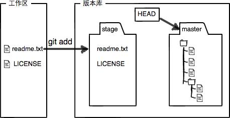

# Git 与 GitHub

## 第一篇,git 关键知识点

```bash
$ git config --global user.name "Your Name"
$ git config --global user.email "email@example.com"
$ mkdir learngit
$ cd learngit
$ pwd #显示当前路径
$ git init
$ ls -ah # 看见隐藏目录
$ git add readme.txt  # 第一步，用命令git add告诉Git，把文件添加到仓库
# 实际上就是把文件修改添加到暂存区(Stage)
$ git commit -m "wrote a readme file"  # 第二步,把文件提交到仓库
# 实际上就是一次性把暂存区的所有内容提交到当前分支.
# 提交后如果没有在工作区继续修改，工作区就是“干净”的.

# -m 提交说明,可以多次 add, 一次 commit.
# 处于受 git 管理的文件夹内的文件,才能被 add.
# git 命令必须在 git 仓库目录内执行(git init 除外)
$ git status  # 查看当前仓库内文件的状态
$ git diff readme.txt  # 查看文件的变化
# 修改到一定程度的时候就可以“保存一个快照”，Git中称为commit
$ git log  # 显示从最近到最远的提交日志
$ git log --pretty=oneline  # 按行简化显示
$ git reset --hard HEAD^  # 当前 HEAD 上版 HEAD^ 上上版 HEAD^^... HEAD~100
$ git reset --hard 1094a  # 指定回到某个版本, 1094a 是版本号的前几位
$ cat readme.txt  # 查看文件
# Git仅仅是把HEAD从指向某个版本,速度很快
$ git reflog  # 显示每一次命令

# Git 和其他版本控制系统如 SVN 的一个不同之处就是有"暂存区"的概念
# learngit 文件夹是个工作区,有一个隐藏目录 .git 是 Git 的"版本库"
# .git 里有很多东西，最重要的是称为 stage（或者叫 index ）的暂存区
# 还有 Git 自动创建的第一个分支 master 以及指向 master 的指针叫 HEAD
# Git跟踪并管理的是“修改”，而不是“文件”。
# 顺序:修改文件-add-进入stage-commit-进入版本库.
$ git diff HEAD -- readme.txt  # 查看工作区和版本库各自最新版本的区别
# 每次修改如果不 git add 到暂存区, 就不会加入到 commit 中
$ git checkout -- readme.txt  # 把readme.txt文件在工作区的修改全部撤销
# 各种情况:
# 一,如果 stage 内没有状态, checkout -- file 回到上次 commit 状态.
# 二,如果 stage 内已有状态, checkout -- file 回到上次 add 状态.
# 三,如果 stage 内已有状态, git reset HEAD <file> 实现 unstage 效果.
# 四,实现 unstage 效果后,继续 checkout -- file 则回到上次 commit 状态.
# 五,已经 add 且 commit, 使用 git reset --hard HEAD^ 回到上一次 commit 版本. 

# 删除文件
$ rm test.txt  # 手动删除文件
$ git status  # 命令会说明哪些文件被"手动"删除了.
# 选择一:
$ git rm test.txt  # "git add/rm <file>..." update what will be committed
$ git commit -m "remove test.txt"  # 确定从 版本库 中也删除文件.
# 选择二:
$ git checkout -- test.txt  # 用版本库里的版本替换工作区的版本
# 删除也是一种修改,也可以用 checkout -- file 实现撤销.
# 从没被添加到版本库(从没 commit 过)就被删除的文件，是无法恢复的！
```

[git-stage](https://www.liaoxuefeng.com/files/attachments/919020074026336/0)


[git-stage-after-commit](https://www.liaoxuefeng.com/files/attachments/919020100829536/0)


## 第二篇,github

```bash
# 注册 github, gitee, coding 等远程仓库.
# 创建SSH Key:
$ ssh-keygen -t rsa -C "youremail@example.com" 
# 登陆GitHub, Add SSH Key
$ git remote add origin git@github.com:michaelliao/learngit.git
$ git push -u origin master
# 由于远程库是空的，我们第一次推送master分支时，加上了-u参数，
# Git不但会把本地的master分支内容推送的远程新的master分支，
# 还会把本地的master分支和远程的master分支关联起来，以后就可以简化命令。
$ git push origin master  # 日常推送, 将本地 master 分支推送到 origin
# 第一次使用Git的clone或者push命令连接GitHub时会得到一个SSH警告
# Are you sure you want to continue connecting (yes/no)?  yes即可
# Warning: Permanently added 'github.com' (RSA) to the list of known hosts.

$ git remote -v  # 查看远程库信息
$ git remote rm origin  # 删除与远端的关系

$ git clone git@github.com:michaelliao/gitskills.git  # 克隆远端库到本地
# GitHub 仓库的地址一般有 ssh 和 https 协议两种, https 速度慢且推送需要密码.

#参与别人的项目: 
# Fork 到自己的账户下, 再 clone 到本地.
# pull request

# 使用 gitee
$ git remote add github git@github.com:michaelliao/learngit.git
$ git remote add gitee git@gitee.com:liaoxuefeng/learngit.git

git push github master
git push gitee master
```

## 第三篇,分支

```bash
# "修改-add-进入stage-commit-进入版本库", 这是一条时间线, 就是一个分支.
# HEAD 严格来说指向 master, master 指向提交; 所以 HEAD 指向的就是当前分支.
```

```bash
                  HEAD
                    ▼
                 master
                    ▼
┌───┐    ┌───┐    ┌───┐
│   │───▶│   │───▶│   │
└───┘    └───┘    └───┘
```

```bash
                 master
                    ▼
┌───┐    ┌───┐    ┌───┐
│   │───▶│   │───▶│   │
└───┘    └───┘    └───┘
                    ▲
                   dev
                    ▲
                  HEAD
```

```bash
                 master
                    ▼
┌───┐    ┌───┐    ┌───┐    ┌───┐
│   │───▶│   │───▶│   │───▶│   │
└───┘    └───┘    └───┘    └───┘
                             ▲
                            dev
                             ▲
                           HEAD
```

```bash
                           HEAD
                             ▼
                          master
                             ▼
┌───┐    ┌───┐    ┌───┐    ┌───┐
│   │───▶│   │───▶│   │───▶│   │
└───┘    └───┘    └───┘    └───┘
                             ▲
                            dev
```

```bash
                           HEAD
                             ▼
                          master
                             ▼
┌───┐    ┌───┐    ┌───┐    ┌───┐
│   │───▶│   │───▶│   │───▶│   │
└───┘    └───┘    └───┘    └───┘
```

```bash
$ git checkout -b dev  # 创建并切换到 dev 分支, 相当于下面两条命令:
$ git branch dev
$ git checkout dev  # Switched to branch 'dev'

$ git branch  # 列出所有分支，当前分支前面会标一个*号
$ git checkout master  # 切换到master分支
$ git merge dev  # 合并 dev 分支到 当前 分支.
# Fast-forward 指合并的“快进模式”; 不是每次合并都能 Fast-forward
$ git branch -d dev  # 删除分支 dev

# 最新版本的Git提供了新的git switch命令来切换分支
$ git switch -c dev  # 创建并切换到新的 dev 分支
$ git switch master  # 切换到指定分支 master
# Git还会自动提示我们当前master分支比远程的master分支要超前N个提交:
# Your branch is ahead of 'origin/master' by 1 commit.
# (use "git push" to publish your local commits)
```

```bash
                            HEAD
                              ▼
                           master
                              ▼
                            ┌───┐
                         ┌─▶│   │
┌───┐    ┌───┐    ┌───┐  │  └───┘
│   │───▶│   │───▶│   │──┤
└───┘    └───┘    └───┘  │  ┌───┐
                         └─▶│   │
                            └───┘
                              ▲
                          feature1
```

```bash
# 上图这种情况下，Git可能无法执行“快速合并”,只能试图合并所有,有可能冲突.
$ git status  # git status 也可以告诉我们冲突的文件
# Git用<<<<<<<，=======，>>>>>>> 在文件内标记出不同分支的内容
# 解决冲突就是把 Git 合并失败的文件手动编辑为我们希望的内容，再提交:
$ git add readme.txt 
$ git commit -m "conflict fixed"
# master分支和feature1分支变成了下图所示：
```

```bash
                                     HEAD
                                       ▼
                                    master
                                       ▼
                            ┌───┐    ┌───┐
                         ┌─▶│   │───▶│   │
┌───┐    ┌───┐    ┌───┐  │  └───┘    └───┘
│   │───▶│   │───▶│   │──┤             ▲
└───┘    └───┘    └───┘  │  ┌───┐      │
                         └─▶│   │──────┘
                            └───┘
                              ▲
                          feature1
```

```bash
# 用带参数的 git log 也可以看到分支的合并情况：
$ git log --graph --pretty=oneline --abbrev-commit
*   cf810e4 (HEAD -> master) conflict fixed
|\  
| * 14096d0 (feature1) AND simple
* | 5dc6824 & simple
|/  
* b17d20e branch test
* d46f35e (origin/master) remove test.txt
* b84166e add test.txt
* 519219b git tracks changes
* e43a48b understand how stage works
* 1094adb append GPL
* e475afc add distributed
* eaadf4e wrote a readme file

# 最后，删除feature1分支：
$ git branch -d feature1
Deleted branch feature1 (was 14096d0).
```

```bash
# Git 通常会用 Fast forward 模式合并分支, 但这种模式删除分支会丢掉分支信息.
# 如果要禁用 Fast forward 模式，Git 就会在 merge 时生成一个新的 commit
# 这样，从分支历史上就可以看出分支信息, 即, --no-ff 方式的 git merge
$ git merge --no-ff -m "merge with no-ff" dev  # 加 -m 参数, 写commit描述

# 合并后，用 git log 看分支历史
$ git log --graph --pretty=oneline --abbrev-commit
*   e1e9c68 (HEAD -> master) merge with no-ff
|\  
| * f52c633 (dev) add merge
|/  
*   cf810e4 conflict fixed
...
```

```bash
# BUG 分支
$ git status  # 查看现状
$ git stash  # 把当前在 dev 分支的工作现场“储藏”起来，以后可恢复继续工作
#切换到主分支,新建并切换到 bug 修复分支
$ git checkout master
$ git checkout -b issue-101
# 修复工作...add 且 commit
$ git add readme.txt 
$ git commit -m "fix bug 101"
# 切换到主分支, 将 bug 修复分支以 保留历史 的方式合并进来.
$ git switch master
$ git merge --no-ff -m "merged bug fix 101" issue-101
# 切换回dev分支,继续干活
$ git switch dev
$ git status
$ git stash list  # 查看隐藏的工作现场清单
$ git stash apply  # 这种方式恢复后 stash 内容仍在，需用 git stash drop 删除.
$ git stash pop  # 这种方式恢复的同时把 stash 内容也删了
$ git stash apply stash@{0}  # 从 stash list 中选择恢复.

# 复制一个特定的提交到当前分支(重放)
$ git branch  # 确认在正确的目标分支
$ git cherry-pick 4c805e2  # 将特定的 4c805e2 提交"重放"到当前分支.
```

```bash
# Feature分支
$ git switch -c feature-vulcan  
$ git add vulcan.py
$ git status
$ git commit -m "add feature vulcan"
$ git switch dev  # 切回dev，准备合并
$ git branch -d feature-vulcan  # Git 会提醒改分支没有合并,删除会丢失修改.
$ git branch -D feature-vulcan  # 用 -D 参数强行删除.
```

## 第四篇,多人协作

```bash
# 当从远程仓库克隆时，Git自动把本地 master 分支和远程 master 分支对应起来.
# 并且，远程仓库在本地的默认名称(代号)是 origin
$ git remote  # 查看远程库的信息
$ git remote -v  # 显示更详细的远程库信息
$ git push origin master
$ git push origin dev
# 在Git中，分支完全可以在本地自己藏着玩，是否推送视心情而定
$ git clone git@github.com:michaelliao/learngit.git
$ git checkout -b dev origin/dev # 创建远程origin的dev分支到本地
$ git add env.txt
$ git commit -m "add env"
$ git push origin dev
# 多人协作有可能推送失败，因为你的小伙伴的最新提交和你试图推送的提交有冲突
$ git pull
# git pull也可能失败，因为没有指定本地 dev 分支与远程 origin/dev 分支的链接
$ git branch --set-upstream-to=origin/dev dev  # 设置dev和origin/dev的链接
$ git pull
# 手动解决冲突,然后 commit
$ git commit -m "fix env conflict"
$ git push origin dev

# Rebase 变基
# 每次合并再push后，分支变成了这样,乱
$ git log --graph --pretty=oneline --abbrev-commit
* d1be385 (HEAD -> master, origin/master) init hello
*   e5e69f1 Merge branch 'dev'
|\  
| *   57c53ab (origin/dev, dev) fix env conflict
| |\  
| | * 7a5e5dd add env
| * | 7bd91f1 add new env
| |/  
* |   12a631b merged bug fix 101
|\ \  
| * | 4c805e2 fix bug 101
|/ /  
* |   e1e9c68 merge with no-ff
|\ \  
| |/  
| * f52c633 add merge
|/  
*   cf810e4 conflict fixed

$ git push origin master
$ git pull
$ git rebase
$ git push origin master

# tag 就是一个让人容易记住的有意义的名字，它跟某个 commit 绑在一起.
$ git branch
$ git checkout master
# 默认标签是打在最新提交的commit上的
$ git tag v1.0
$ git tag
# 找到历史提交的commit id，然后打标签
$ git log --pretty=oneline --abbrev-commit
$ git tag v0.9 f52c633
$ git tag
$ git show v0.9
# 还可以创建带有说明的标签，用-a指定标签名，-m指定说明文字
$ git tag -a v0.1 -m "version 0.1 released" 1094adb
$ git show v0.1
# 注意:标签总是和某个commit挂钩。
# 如果某commit出现在master, dev 等多个分支，那么在这些分支上都能看到这个标签
# 创建的标签都先存储在本地，不会自动推送到远程,打错的标签可以在本地安全删除
$ git tag -d v0.1  # 删除标签
$ git push origin v1.0  # 推送某个标签到远程
$ git push origin --tags  # 一次性推送全部尚未推送到远程的本地标签

# 如果标签已经推送到远程，要删除远程标签就麻烦一点，先从本地删除
$ git tag -d v0.9
$ git push origin :refs/tags/v0.9
# 可以登陆GitHub查看是否真的删除了标签
```

## 第五篇,自定义Git

```bash
$ git config --global color.ui true  # Git会适当地显示不同的颜色
# .gitignore 文件
# GitHub 准备了各种配置文件 https://github.com/github/gitignore
# 检验.gitignore的标准是git status命令是不是说working directory clean
$ git add -f App.class  # 可以用-f强制添加到Git
$ git check-ignore -v App.class

# 排除所有.开头的隐藏文件:
.*
# 排除所有.class文件:
*.class

# 不排除.gitignore和App.class:
!.gitignore
!App.class 

# 配置别名
$ git config --global alias.lg "log --color --graph --pretty=format:'%Cred%h%Creset -%C(yellow)%d%Creset %s %Cgreen(%cr) %C(bold blue)<%an>%Creset' --abbrev-commit"
# 使用别名
$ git lg

#配置文件
# 配置 Git 加上 --global 是针对当前用户的所有仓库，不加只针对当前的仓库
# 仓库的 Git 配置文件都放在 .git/config 文件中
# 当前用户的 Git 配置文件放在用户主目录下的一个隐藏文件 .gitconfig 中
```
